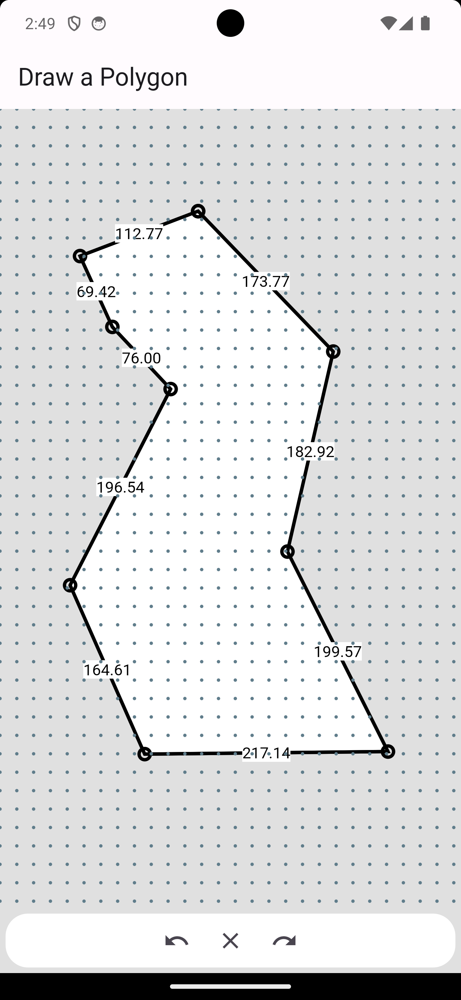

# polygon_painter

## Overview

This Flutter app allows users to draw and edit polygons on a canvas. Users can create shapes by connecting lines and dynamically see the length of each line segment.
Once a shape is closed, it is filled with white color. The app includes features for undoing and redoing actions, as well as the ability to move and adjust the vertices of the completed polygon.

 

## Features

- **Drawing Lines**: Tap and drag across the screen to draw lines.
- **Dynamic Line Length**: View the length of each line segment as you draw.
- **Closing Shapes**: Automatically close and fill shapes when the end point meets the starting point.
- **Editing Shapes**: Move vertices of the completed polygon to adjust its shape.
- **Undo/Redo**: Undo or redo actions to correct mistakes.
- **White Fill for Closed Shapes**: Automatically fill closed shapes with white color.

## How to Use

1. **Drawing a Shape**: Start by tapping and dragging your finger across the screen to draw lines. The length of the line will be displayed dynamically.
2. **Completing a Shape**: To close a shape, bring the end point of the last line close to the starting point of the first line.
3. **Editing a Shape**: Once a shape is closed, tap and drag any vertex to adjust the shape of the polygon.
4. **Undo/Redo**: Use the undo and redo buttons to correct any mistakes during drawing or editing.
5. **Restart**: To start a new drawing, use the clear button to reset the canvas.

## Technical Details

- **State Management**: The app uses the Provider package for state management.
- **Custom Painting**: CustomPainter is used to draw and fill polygons on the canvas.

## Setup and Installation

To run the Polygon Drawing App, follow these steps:

1. Clone the repository.
2. Navigate to the project directory.
3. Run the app using Flutter.
